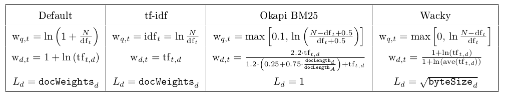

# SearchEngine

A search engine that works with JSON files to perform search operations over an indexed directory.

# Introduction :
	
The project involves creating an index from a corpus of documents provided. The project focuses on the following key areas:

    - How can the indexing process be made faster.
    - How to gain better insights from the data created while creating such an index.
    - different kinds of ranking algorithms that can applied to gain more meaningful information from these results.
    - precision-recall trade-off.     

**Abstract :**

Information retrieval represents one of the most classical problems in computer science.  How do we define an information as useful to user and how do we ascertain if we can improve precision and recall of our search engine in meaningful ways:

At first we look at how common '*stop*' words like the, is etc. can effectively be ignored to produce better results in most scenarios. We call this the weight a term has in a document. If a term appears too many times in a document it is highly likely that the document could be extremely relevant for that term. But on the other hand this approach is biased towards very large documents, which can have a certain term repeat many times. Therefore it becomes necessary to normalize the effect this property has on our results.

Other interesting thing to note is that we can assume that if a term appears too many times in a given corpus, then it can not really be trusted to be a good discriminator between two documents obtained for a given query.

Therefore in due course, we find out and engineer some features about our corpus and the index we created from it and somehow engineer a concept of mathematical relevance. And for terms like “Apple” which can have different meaning depending on the context in which the term has been used, the results may vary considerably in accuracy depending on the corpus provided.

# Overview :

The Search Engine works in two modes :

### Boolean Query Mode

In Boolean Query Mode, the Search Engine returns the documents in the order in which it finds them. This mode supports operations like *searchTerm1 + searchTerm2*, which can be understood as "documents containing either the *searchTerm1* or *searchTerm2*".

### Ranked Query Mode

In Boolean Query Mode, a query is processed without any Boolean operators to return the top 20 documents satisfying the query. The term at a time algorithm is used:

a) Acquire an accumulator Accum for results for each document. This is how relevant a document is to the user query.

b) For each term in user query, we get the '*posting lists*' returned in the results of the posting for the query term. Then for each posting

-  Calculate W q,t using the given formulas
-  Calculate W d,t using the given formulas

- For each document d returned in the posting list of the result of query term increase the accumulator Accum of that document by (W q,t * W d,t) and divide non-zero accumulators with Ld.

Example : a term like 'Jacaranda trees' will return many documents that may contain the word trees many times but are irrelevant. But a document that mentions the term 'Jacaranda' is certainly more relevant to our query.

***Variant tf-idf formulas:*** The information we just discussed has been encapsulated in these formulas through which we hope to get good results with good precision and recall. 

In the table:
	
	• docWeights d is the Euclidian weight of document d, described in Ld.
	• docLength d is the number of tokens in document d.
	  docLength A is the average number of tokens in all documents in the corpus.
	• byteSize d is the number of bytes in the file for document d
	• ave (tf t,d ) is the average tf t,d count for a particular document.
	
* N → Number of documents in the corpora. 
* tf → the term frequency of a term in a document. i.e. number of times the term appears in a given document.
* dft → the document frequency of a term in document corpus. i.e the number of documents containing the term in a given document corpus.
* idft → the inverse of dft.
* W q,t → the weight associated with a query term.
* W d,t → the weight associated with each document contained in the results for the given query term.
* Ld → the normalization of the effect of document length on our results.

**To normalize those w d,t terms and find Ld, sum the squares of all the w d,t terms and then take the square root. That is square root of (sum of squares of all w d,t terms).
This value is stored in the docWeights file.**
	

These formulas take different factors into consideration while giving us a result. All these formulas can be thought of having some biases towards the factors they favor heavily, and we will see in our results how these factors come into play.

# Methodology :

• The entire document corpus was indexed using a positional inverted index, which in simpler terms is a way of keeping track of which document appears where in our corpus. Once indexing is complete, the index is written to disk. We also write other important values about our index on the disk such as the tf and idf values.

• The disk based index is created from a memory based index which is sorted alphabetically. This allows us to perform more efficient binary search over a document corpus for our term. The index stores a list of 'postings' for a given term. A posting is an object that represents a document and all the positions a term appears in that document. A list of postings thus give us all the documents containing a given term and the position of terms in the document.
  
  
• When a user submits a query, the index stored on the disk is queried for a list of documents that contain the particular term. The index is made of stemmed tokens, and the user query is also stemmed to retrieve the results. This is done to avoid having two lists for words like “national, nation” which may represent a single information need.
  
• Once a list of documents corresponding to a query have been retrieved, the formulas mentioned above are applied over it. The formulas give discriminating set of values that we can use to provide some form of notion of relevance to our documents.

• The documents are stored in a priority queue and then popped from the top of the queue. The most relevant documents as per our query are ranked at the top followed by other documents.
  
• The results are compared to see which formula performs closer to our ideal results

**Running the project :**

The project was developed on openjdk8 and supports maven dependency management. Simply import the pom.xml file to automatically configure the IDE.

The testdirectory contains some documents that this project has been tested on. The relative path of these directories can simply be copy-pasted when running the project.
  

# Project Status :

This is a large project with three milestones. The following is a summary of major features to be  implemented in each milestone.

### **Milestone 1:**

- [x] Incorporate directory-selection and JSON documents into the application.
- [x] Program the *PositionalInvertedIndex* class and incorporate it into the indexing process. The *PositionalInvertedIndex* class builds an index that is made of terms and posting lists for each term which tell us the positions where the term is in a given document.
- [x] Write a new *TokenProcessor* to handle the following rules. Update the *TokenProcessor* interface to support multiple terms per token.
	1. Remove all non-alphanumeric characters from the beginning and end of the token, but not the
	middle. Example: *Hello.* becomes *Hello* ; *192.168.1.1* remains unchanged.
	2. Remove all apostropes or quotation marks (single or double quotes) from *anywhere in the string*.
	3. For hyphens in words, do both :
		+ (a) Remove the hyphens from the token and then proceed with the modified token;
		+ (b) Split the original hyphenated token into multiple tokens without a hyphen, and proceed with all split tokens. (So the token "Hewlett-Packard-Computing" would turn into HewlettPackardComputing, Packard, Hewlett and Computing .)
	4. Convert the token to lowercase.
	5. Stem the token using an implementation of the Porter2 stemmer.

- [x] Create *BooleanQueryParser* to handle boolean queries. That is queries in the form of *shakes + smoothies mango*.
	* Update *findNextLiteral* to recognize and construct *PhraseLiteral* objects.
	* Incorporate a *TokenProcessor* into the *getPostings* call sequence.
	* Write the *getPostings* methods of *AndQuery*, *OrQuery* and *PhraseLiteral* .
	* Amend query language to support the boolean NOT operator as a '*minus*' (-) sign.
	* Integrate *BooleanQueryParser* into the application.
- [x] Implement an architecture for the following special queries.
	+  **:q**  exit the program.
	+  **:stem** ***token*** take the *token* string and stem it, then print the stemmed term.
	+ **:vocab**  print the first 1000 terms in the vocabulary of the corpus, sorted alphabetically, one term per line. Then print the count of the total number of vocabulary terms.
- [ ] The main application should be programmed to *abstract interfaces only*.  All the methods of the application should only refer to the Index interface after the point of construction.
- [ ] **Expanded query parser:** Tweak the query parser and execution engine to redefine the term query literal as:
	1. a single token.
	2. a sequence of tokens that are within double quotes, representing a phrase literal.
	3. a pair of parentheses surrounding a DNF query.
	The search engine now supports queries like *smoothies (mango + banana) + "vanilla shakes"*, for someone wanting to know about either *mango smoothies or banana smoothies*, OR wants to know about *vanilla shakes*.
- [ ] **Wildcard queries:** Amend the query parser to support wildcard literals with arbitrary numbers of * characters representing wildcards. To support this feature, edit the definition of query literal above to:
	1. a single token
	2. a sequence of tokens that are within double quotes, representing a phrase literal
	3. a single token containing one or more * characters, representing a wildcard literal. 
	4. Implement 1-, 2-, and 3-grams for each vocabulary type with a new class.
- [ ] **Soundex algorithm:** Implement the *soundex algorithm* so the search engine's users can search Boolean queries on the authors of documents in corpus, using tolerant retrieval for misspelled names.
- [ ] **Document snippets:** Implement a snippet constructor module. A snippet is a subset of a document that surrounds an occurrence of the terms in the query.
- [x] **NEAR operator:** Implement the NEAR/K operator. To simplify the parsing of NEAR operators, the entire operator is required to be in square brackets, as in *[baseball NEAR/2 angels]*.
Given a value K, do a positional merge between the terms to the left and right of the NEAR operator, selecting documents where the second term appears at most K positions away from the first term. 
- [ ] **Biword index:** When indexing the corpus, additionally build a biword index. When the user enters a phrase query literal, use the biword index to satisfy the PhraseLiteral's postings if and only if the phrase query contains only two terms; use the positional index otherwise. The biword index can be a non-positional index, that is, record document IDs for each biword entry, but not the position of the biword in the document.
- [x] **Unit testing framework:** Implement a unit testing framework for portions of search engine. Design, implement, and run unit tests to verify the correctness of various modules of the search engine.

